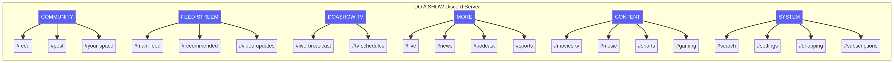

# DO A SHOW Discord Server Structure

This document outlines the conceptual structure of the **DO A SHOW** Discord server, reconstructed from the project's channel specifications.

## Server Architecture

### Channel Categories

| Category | Purpose |
| :--- | :--- |
| **COMMUNITY** | Engagement hubs for fans and creators, including feeds and personal spaces. |
| **FEED-STREEM** | Real-time updates, recommended content, and video notifications. |
| **DOASHOW TV** | The core broadcasting hub for live shows and schedules. |
| **MORE** | Specialized content like News, Podcasts, and Sports. |
| **CONTENT** | Categorized media libraries for Movies, Music, Gaming, and Shorts. |
| **SYSTEM** | Utility channels for search, settings, and subscriptions. |

---
*Generated by Manus for the doaashow project.*
