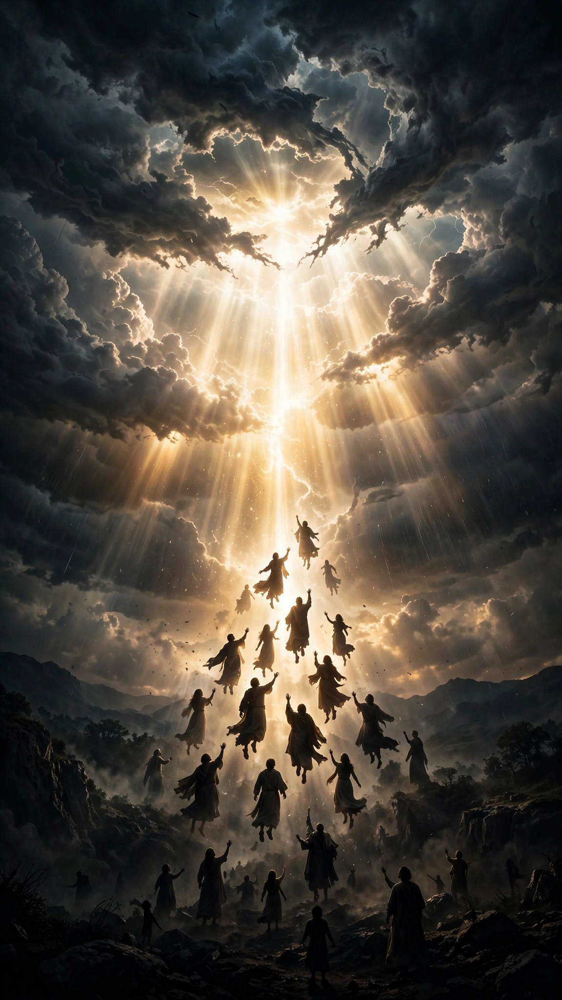

# AFTER THE TRUMPET

A Matt Grosso Studios micro-drama series — a faith-based supernatural thriller in 12 vertical episodes.

## The story

At 11:59 p.m., fearless livestream host **Mara Cross** mocks her sister's warning about the Rapture. One minute later, millions vanish — including her sister. Hunted by a crisis-management empire that wants to control the truth, Mara must turn her camera back on and decide what she believes before fear becomes the new world religion.

## Format

- 12 serialized episodes, 60–90 seconds each
- 9:16 vertical frame, built for phones
- One decisive cliffhanger per episode
- Genre: supernatural thriller with family drama, romance, betrayal, and faith

## What's in this project

| Path | What it is |
|---|---|
| `script/after-the-trumpet-script.md` | Full Season 1 screenplay — all 12 episodes, characters, and locations |
| `docs/EPISODES.md` | Episode-by-episode guide with loglines and cliffhangers |
| `docs/PRODUCTION.md` | Production notes: format specs, cast list, locations, reusable bumper assets |
| `media/opener.mp4` | 7s series opener — "RAPTURE / A Matt Grosso Studios Micro Drama" |
| `media/closer.mp4` | 7s series closer — "TO BE CONTINUED" end card |
| `media/ep1-teaser.mp4` | 44s teaser cut for Episode 1, "11:59" |
| `media/keyart.webp` | Series key art |

## Episodes

1. "11:59" — Anna's warning becomes reality on Mara's livestream.
2. "The Empty Dress" — Daniel arrives wearing the symbol Anna feared.
3. "Do Not Trust Him" — Anna's final message points directly at Daniel.
4. "The List" — Mara discovers that the vanished were tracked in advance.
5. "The Pastor Who Stayed" — the one man expected to have answers has none.
6. "Choose a Side" — Daniel appears to betray Mara at gunpoint.
7. "The Bullet" — Daniel makes his real choice, then Anna calls from the impossible.
8. "Her Voice" — Mara follows the call into a synthetic-voice trap.
9. "Go Live" — captured, Mara agrees to become Vale's official voice.
10. "The Truth Feed" — Mara hijacks the broadcast and starts a resistance.
11. "The Price" — Daniel trades Mara for his sister's life.
12. "One More Warning" — Mara returns to the air as a new system rises.

## Credits

Written and produced by Matt Grosso Studios. A fictional interpretation inspired by Christian end-times tradition.
